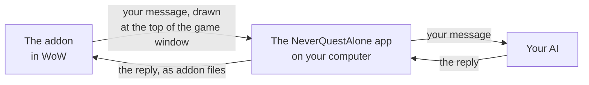

# How NeverQuestAlone works

NeverQuestAlone is a quest companion for World of Warcraft®: Forever. It sits by your quest tracker, plans your quests, redraws your route on the map as you play and answers your questions in a window inside the game. It thinks with the AI you pick: through the NeverQuestAlone app with your own API key, or by Copy and Paste with any AI chat.

This page explains exactly what it does, what leaves your computer, and how to check all of it yourself.

> **Unofficial.** NeverQuestAlone is not made, reviewed or endorsed by Blizzard Entertainment, and it isn’t affiliated with Anthropic, OpenAI, Google, xAI or OpenRouter. It reads the top of the game window, the addon’s saved file and the game’s version number, and writes addon files. It never controls your character.

## The short version

- **Addons can’t reach the internet.** So the addon draws your message at the top of the game window, the app on your computer reads it, asks your AI, and hands the reply back to the game as addon files.
- **It never touches the game itself.** No key presses, no clicks, no memory reading, nothing posted to chat.
- **There’s no NeverQuestAlone server.** The app talks straight to the AI company you picked. Nothing goes to us.
- **Your key never enters the game.** It stays in your macOS Keychain or Windows Credential Manager.
- **You can check what matters yourself:** what the app connects to, what it sends and where your key is kept. See [Check it yourself](#check-it-yourself).

## What it’s made of

- **The addon** runs inside the game. It draws the chat window, the HUD beside your quest tracker, and map pins. Like every addon, it can’t reach the network or read other files while the game runs. Its folder is `NeverQuestAlone`.
- **The parts** are 200 small addons, NeverQuestAlone Part 001 to Part 200 (folders `NQA_S001` to `NQA_S200`). Each one holds one reply at a time. The AddOns list folds them under NeverQuestAlone Parts: leave them checked.
- **The app** sits in your menu bar or system tray. It holds your settings and your key, talks to your AI company, and keeps your chat history on your computer.
- **The capture helper** is a small program the app runs while Screen reading is on. It reads only while WoW is open, only the top of the game window, where the addon draws, and it has no network code.
- **Your AI:** Claude, ChatGPT, Grok or Gemini with your own key from Anthropic, OpenAI, xAI or Google; or Other: any OpenAI-compatible service at its own address (OpenRouter, Groq, Together, or Ollama or LM Studio on your own computer), with its key if it takes one.

## One message, start to finish

1. You type a message in the chat window and press Enter.
2. The addon draws the message as a strip of small colored squares along the top of the game window, from its left edge. If game data is on, your own character’s level, class, zone and quests go along.
3. The capture helper reads only the top of the game window (a band about 300 points tall, as wide as the strip needs and never wider than the window, a few times a second) and decodes the strip. It doesn’t look at the rest of your screen. On Windows it reads that part of your screen, so anything you put over it is read too, and never kept.
4. The app checks your daily spend limit, if you set one, and sends the request to your AI company over HTTPS. Your key goes only in that request, only to that company.
5. When the reply comes back, the app removes anything in it that could pass for game text or a link, writes it into one of the parts, and changes a short sound file the addon listens for.
6. The addon hears it, loads the reply and shows it in the chat window. Nothing is posted to chat.

The strip only shows while a message is waiting. Replies usually arrive a few seconds after the AI finishes. That sound-file trick needs Enable Sound on in the game’s sound settings. With it off, the addon checks on a timer instead (after 5, 12, 25 and 45 seconds), and tells you so in game.

## What it never does

These are fixed rules. Tests run on every build to check the addon’s side, for example that it never calls the game’s movement, casting, macro or chat functions.

1. **No input to the game.** No key presses, mouse or controller events, ever.
2. **No memory reads or writes, no injection.** Nothing hooks into the game or changes the game’s own files. Outside its own files, the app reads only the top of the game window, the addon’s saved file and the game’s version number (to keep the addon loading after a patch), and writes only its own addon files.
3. **Nothing happens without you.** Every message starts with your click or key press, except check-ins, which are off until you turn them on. Nothing is posted to chat, mail or other players. The addon calls no protected functions, so it can’t move, cast, target or trade.
4. **No combat data.** The strip carries only what you typed and your own character’s state. NeverQuestAlone never checks in during combat.

It never reads other players’ chat, your guild roster or your friends list.

**The AI can’t act either.** It has no tools: it can’t run commands, read or write files, browse the web, send messages or spend money. It can only write replies in the chat window and routes and pins on your map, which the app checks first. Web addresses in a reply show as plain text you can’t click, and item and quest links are rebuilt by the addon from numbers only.

## No screen reading

Turn off **Screen reading** on the app’s Your data page, or **Screen Reading** in the addon’s Settings (under What NeverQuestAlone Knows), or type `/nqa reading off`; off in either place wins. With screen reading off, the addon draws no strip and the app stops its capture helper, so nothing on your screen is read (on a Mac, the Screen Recording indicator goes off). Your messages wait in the addon’s saved data and go when you reload the game’s interface (click Reload above the chat window; a short loading screen, never in combat). Replies still come in on their own. To switch back, turn it on where you turned it off (`/nqa reading on` for the addon’s); the addon’s switch takes effect at your next reload.

`/nqa mode reload` is stricter still: replies also wait for a reload. `/nqa mode pixel` switches back.

## What leaves your computer

Your messages, and if you choose, your own character’s game data, go to the AI company you picked. Nothing goes to us. [Privacy in NeverQuestAlone](PRIVACY.md) has the full list, every setting, and each AI company’s rules.

- **By default,** your character’s name, realm and guild stay out (the AI sees “your character”). Other players’ names from the game (your target, players you shift-click, “Made by” lines) are swapped for stand-ins like “Player A” before anything is sent, and swapped back in the reply on your computer. Names you type yourself are sent as you typed them.
- **Your chat history** stays on your computer. The app keeps its copy in a folder only your user account can read and deletes it after 30 days; you can change that, or delete it all. The addon keeps each chat’s last 200 replies and messages in WoW’s saved files until you delete the chat in game or uninstall with the addon. Delete all in the app doesn’t remove them.
- **Nothing is sent to us.** No telemetry, analytics or crash reports. The only other traffic is the update check to GitHub, which you can turn off.

## Your key

- **It goes in through the app only,** never the game. If you paste something that looks like a key into the chat window by mistake, the addon won’t send it: “That looks like an API key, so it wasn’t sent. Keys go in the NeverQuestAlone app, never in game.” The app won’t send one either, if it ever gets that far.
- **It’s saved where your system keeps passwords:** your macOS Keychain, or Windows Credential Manager.
- **It’s only read when a request goes out,** and only sent to that AI company.
- **It never goes into** the game, the game’s saved data, the strip, the parts, the app’s settings file, its logs, crash output or any other program.

Who can read it, honestly:

| Who | Can they read your key? |
|---|---|
| Other people with their own login on this computer | No. |
| Other programs you run, on Windows | **Yes**, like any saved password: that’s how Windows keeps them. Keep a spend limit on your key at your AI company. |
| Other programs you run, on macOS | macOS asks you first. |
| Other game addons | No. The key never enters the game. |
| Us, the developers | No. There’s no server, and the app only talks to the hosts listed in Connections. |
| Someone reading a bug report you shared | No. Logs and diagnostics take keys out. |

A stolen key works anywhere, so a spend limit at your AI company is the real backstop. The app links to each company’s limit settings.

## What it costs

NeverQuestAlone sets no limits on how much you use it: no daily spend limit unless you set one, no limit on messages, none on check-ins. It counts every reply’s cost, so you always see what you spent. What controls your spending:

- **Your AI company’s limits.** The spend limit you set there (the real backstop), and its rate limits. The app shows you the line your AI company sends and never works around it.
- **Your own daily spend limit, if you want one.** There’s none unless you set it on the app’s Your AI page, at Daily limit (the app asks you to confirm a higher limit, or turning it off). It resets at local midnight.
- **A model on your own computer** is free.
- **A service you connect with Other** bills you at its own prices. The app shows the exact cost when the service reports it (OpenRouter does), and otherwise counts each reply at the price of the most expensive model it knows.

How a request’s size and cost are counted

Before each request, the app checks that today’s spend plus that request’s estimated cost stays within your daily spend limit, if you set one. Two chats can run at once, and each is counted when it finishes, so together they can pass your limit by what those two replies cost.

AI companies bill in tokens, small chunks of text. One request is at most 20,000 tokens in and 1,200 out, plus room for the AI to think at the Thinking level you pick (none at Off, 2,048 tokens at Low, up to 65,536 at Max). Every company bills thinking as output. The README’s cost example counts thinking at Low. Prices come from a price table dated and shipped with the app. The chat window’s header shows today’s spend, like `$0.18 today` (or `$0.18 of $5.00 today` with a $5.00 limit).

One safety catch that normal play never reaches: if something went wrong and the game sent a burst of check-ins (more than 10 in a minute, or 60 in an hour), NeverQuestAlone pauses them and says so once in the Check-ins chat: “NeverQuestAlone paused check-ins: your next message turns them back on.” Your next message starts them again, and the check-ins it held go along with that message.

When something goes wrong (a rejected key, no credit, a busy AI, a spend limit reached), you see one plain line in game with the next step, and the fix is in the app. The app never switches to another AI on its own.

## Connections and Last request

- **Connections** lists every host the app connected to: the host, port, how many times, when, and why (your AI company, a key test, the update check, a model on your computer). The app can only connect to the AI company you chose (with Other, the one host of the address you gave it), GitHub for updates, and a model server on this computer if you use one. Anything else is blocked before the app even looks it up, and listed as Blocked.
- **Last request** shows exactly what was sent for the last message in each chat, with the key hidden as `sk-ant-…A1b2 (redacted)`.

Connections can only list what the app itself connected to. To see everything your computer connects to, check from outside the app (below). Nothing the app ships does its own networking: the capture helper has no network code, and the keychain part makes no network calls.

The one listening port

In normal use the app has no listening network port. There is one short exception, on your own computer only (127.0.0.1, a random port):

- **Installing an update on macOS:** the updater hands the downloaded update to macOS’s installer through a local port protected by a random password, and closes it once the installer has read the file.

## What other addons can see

Every addon can read what’s inside the game: that’s how the game works, and no addon can change it. So other addons can read the replies and history in the chat window, and the spending line in its header. Your key is never there. The app’s **Replies in chat frame** switch (Settings > Show more) is off by default, because chat-logging addons keep copies of the chat frame.

## Updates

- Updates come from NeverQuestAlone’s GitHub Releases page. The app checks each installer’s signature and publisher, and refuses one that isn’t newer than what you run.
- The app tells you when an update is ready and installs it when you quit. It never restarts while the game is running.
- Model names and prices ship with the app. When an AI company changes them, an app update brings the new ones.
- “Update checks” is a switch on the app’s About page (Settings > Show more > About). Turn it off and the app never contacts GitHub; check the Releases page yourself when you want a new version.

## Check it yourself

You don’t have to take any of this on trust.

**Watch the network** while you play and send a few messages:

- **Windows:** [TCPView](https://learn.microsoft.com/en-us/sysinternals/downloads/tcpview), free from Microsoft. Filter by NeverQuestAlone. You should only see your AI company (for example `api.anthropic.com`) and GitHub, shortly after the app starts and every 12 hours, unless Update checks is off. Apart from an update installing on macOS, you should see no listening ports.
- **Mac:** [LuLu](https://objective-see.org/products/lulu.html) (free and open source) or Little Snitch. Both ask before a program connects anywhere, and show you where.

What you see should match the app’s Connections page.

**Find your key where it’s saved:**

- **Windows:** Control Panel > Credential Manager > Windows Credentials. Look for NeverQuestAlone with your AI company’s name (for example `anthropic.NeverQuestAlone`). On a work PC with a roaming profile, it roams with your profile.
- **Mac:** Keychain Access > login keychain. Search for NeverQuestAlone; the account is your AI company’s name.

Commands to check a download

- Every release lists SHA-256 checksums. Compare with `shasum -a 256 <file>` on a Mac or `Get-FileHash <file> -Algorithm SHA256` in Windows PowerShell.
- On a Mac, `spctl --assess --verbose "/Applications/NeverQuestAlone.app"` shows Apple’s notarization check. On Windows, the installer’s Properties > Digital Signatures tab shows the publisher.

**See what was sent:** in the app, open Your data > Last request after any message.

## Credits

NeverQuestAlone is built on [chelinho139/wow-ai](https://github.com/chelinho139/wow-ai) (MIT). The addon’s code is in its download, under the [MIT license](LICENSE). The app’s source isn’t public yet. [Credits](CREDITS.md)

---

World of Warcraft, Warcraft and Blizzard Entertainment are trademarks or registered trademarks of Blizzard Entertainment, Inc. in the U.S. and/or other countries. NeverQuestAlone is unofficial and is not affiliated with or endorsed by Blizzard Entertainment, Anthropic, OpenAI, Google, xAI or OpenRouter. Other names are the trademarks of their owners and are used only to say which service you can connect.
