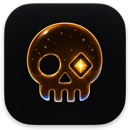
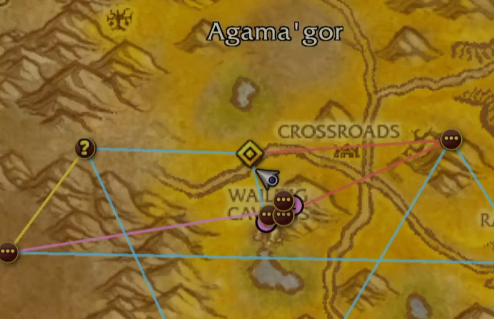
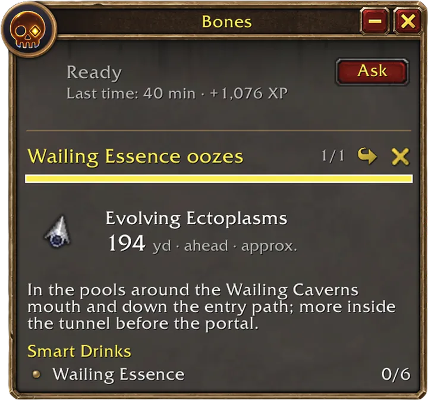
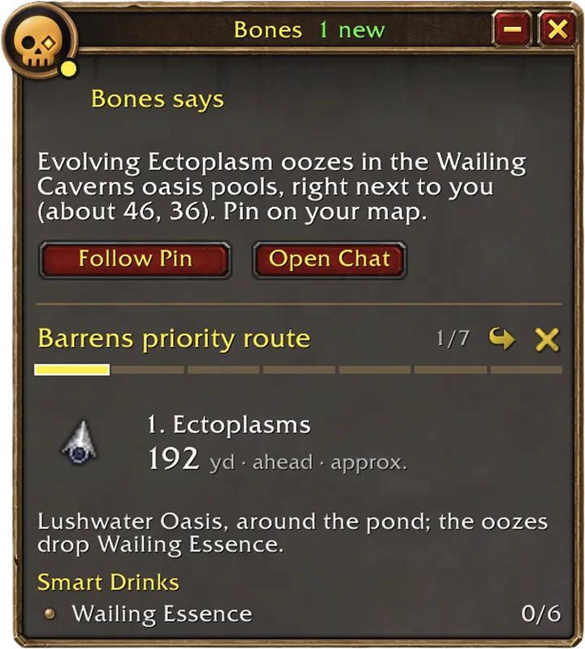
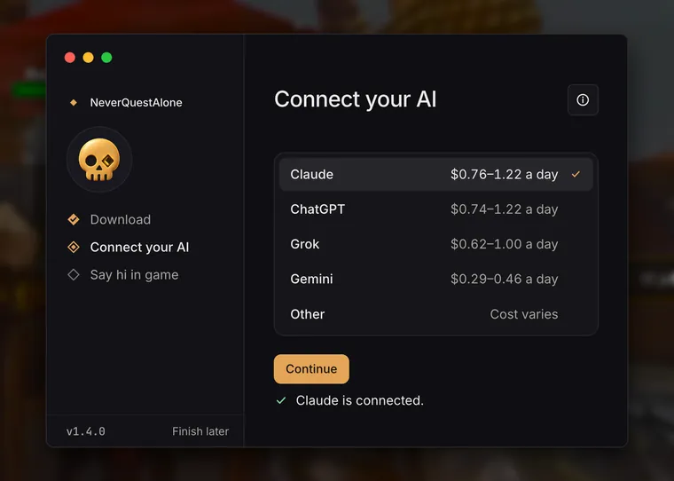

# NeverQuestAlone

**Always know where to go next.** NeverQuestAlone is a free quest companion for World of Warcraft®: Forever. Bones, the skull by your quest tracker, plans your quests and redraws your route on the map as you play. Bones runs on the AI you pick: Claude, ChatGPT, Grok or Gemini with your own API key, another OpenAI-compatible service, or a model on your own computer.

**[Download for Mac](https://github.com/neverquestalone/neverquestalone/releases/latest/download/NeverQuestAlone-mac.dmg)** · **[Download for Windows](https://github.com/neverquestalone/neverquestalone/releases/latest/download/NeverQuestAlone-Setup.exe)** · [All downloads](https://github.com/neverquestalone/neverquestalone/releases/latest)

## What it does

- **Your next stop is always on screen.** How far it is, and what to do when you get there.
- **Your map always shows the best route.** Every stop in your quest log, in the best order, on the map and minimap.
- **Ask when you’re stuck.** Type a question in game and get a waypoint or clear directions.
- **Less clicking, if you want it.** Quality-of-life options like Auto Accept Quests and Auto Sell Junk finish what you start: talk to a quest giver and the quest is accepted; open a vendor and your gray items are sold. They’re off until you turn them on.

  
  

**It never plays for you.** No key presses or mouse clicks, no memory reading, nothing posted to chat. The AI can only write text into Bones’s window.

**Free, no account, no tracking.** You pay your AI company only for what you use.

> **Unofficial.** NeverQuestAlone isn’t made, reviewed or endorsed by Blizzard. [How it works](HOW-IT-WORKS.md) explains exactly what it does.

## Set up in three steps

It takes 2–3 minutes once you have an API key. You need:

- **World of Warcraft: Forever**, in Windowed or Windowed (Fullscreen) mode, with Enable Sound on in its sound settings.
- **macOS 14 or later, or Windows 10 or 11.**
- **An API key** for the AI you want, with a few dollars of credit. [What’s an API key?](#whats-an-api-key)

### 1 Download

Download NeverQuestAlone for [Mac](https://github.com/neverquestalone/neverquestalone/releases/latest/download/NeverQuestAlone-mac.dmg) or [Windows](https://github.com/neverquestalone/neverquestalone/releases/latest/download/NeverQuestAlone-Setup.exe).

- **Mac:** open the `.dmg`, drag NeverQuestAlone to Applications and open it from there. If macOS asks whether you’re sure, click **Open**.
- **Windows:** open `NeverQuestAlone-Setup.exe`. It installs and opens by itself. If Windows says “Windows protected your PC”, click **More info**, then **Run anyway**.

### 2 Connect your AI

1. Pick an AI, like Claude.
2. Click **Open Anthropic’s key page**, make a key and copy it. Add a few dollars of credit there too.
3. Click **Paste Anthropic key**, then **Agree and connect**. The app tests the key and saves it in your macOS Keychain or Windows Credential Manager.
4. Click **Continue**.

The buttons name the company behind the AI you picked: Anthropic for Claude, OpenAI for ChatGPT, xAI for Grok and Google for Gemini.

Using another service, or a model on your own computer? Pick **Other**, click **Connect another AI**, fill in its address (Base URL), key and model, and click **Connect**.

The defaults send the least that works: your character’s name, realm and guild stay out, and other players’ names are swapped for stand-ins. Change them later on the app’s Your data and Settings pages.

### 3 Say hi in game

1. **Install the addon.** Click **Install**. If WoW is open, click **Install when WoW closes** instead: new addons only load when the game starts.
2. **Allow Screen Recording** (Mac only). Click **Allow**, then **Open System Settings** in the macOS box, and turn on NeverQuestAlone. The app only reads the top of the game window, where the addon draws.
3. **Start WoW** and log in. Bones meets you by your quest tracker.
4. **Say hi.** Click **Say Hi**, or type `/bones hi` in chat. When Bones answers, you’re set.

NeverQuestAlone lives in your menu bar (on Windows, the system tray by the clock).

**No app?** The addon also works on its own with Copy and Paste: you copy each message into any AI chat and paste the reply back. Download `NeverQuestAlone-addon.zip` from the [releases page](https://github.com/neverquestalone/neverquestalone/releases/latest) and unzip it into the `Interface/AddOns` folder inside your World of Warcraft `_forever_` folder.

## What it costs

The app is free, and NeverQuestAlone sets no limits of its own. You pay your AI company for what you use.

| AI | What you need | Cost |
|---|---|---|
| **Claude, ChatGPT, Grok or Gemini** | An API key from Anthropic, OpenAI, xAI or Google, with a few dollars of credit | Pay as you go (example below) |
| **Other: an OpenAI-compatible service** | Its address, a key if it takes one, and a model’s name (OpenRouter, Groq, Together and others) | That service’s prices |
| **Other: a model on your computer** | Ollama (`http://localhost:11434/v1`) or LM Studio (`http://localhost:1234/v1`) with a model downloaded | Free. What you ask stays on your computer. The model shares your graphics card with the game |

On Claude Sonnet 5.5, Claude’s default, 40 replies a day cost about $0.76–1.22, so $5 of credit lasts 4 to 7 days. That’s about 1.9–3.0¢ a reply. The app shows your real figures.

**A Claude, ChatGPT, Gemini or Grok subscription isn’t an API key.** Only API keys work.

**Set a spend limit at your AI company.** It’s what stops a runaway bill or a leaked key, and the app links to the right page. When you reach it, you get one line in game, like “You’ve reached the spend limit you set at Anthropic.”

**Want a daily spend limit too?** Set one on the app’s Your AI page (Daily limit). There’s none unless you set it, and it resets at midnight.

## Your privacy, in short

- **Nothing goes to us.** There’s no NeverQuestAlone account, server, analytics or tracking.
- **Your messages and game data go only to the AI you pick.** Your character’s name, realm and guild stay out unless you turn them on.
- **Your key stays on your computer**, in your macOS Keychain or Windows Credential Manager, and goes only to its own AI company.
- **Your chat history stays on your computer** and is deleted after 30 days. You can change that in the app.
- **You can see everything.** On the app’s Your data page, Last request shows exactly what was sent, and Connections lists every address the app talked to.

More: [Privacy in NeverQuestAlone](PRIVACY.md).

## In game

| Command | What it does |
|---|---|
| `/bones` | Opens or closes the window (`/nqa` does the same) |
| `/bones <question>` | Asks Bones a question |
| `/bones hi` | Says hi (the first time, it finishes setup) |
| `/bones settings` | Opens Settings |
| `/bones qol` | Opens Quality of Life in Settings |
| `/bones reading off` | Stops the app reading your screen: messages wait for a reload (see [No screen reading](HOW-IT-WORKS.md#no-screen-reading)). `/bones reading on` turns it back on |
| `/bones paste` | Opens Copy and Paste again, when you play without the app |
| `/bones diag` | Shows diagnostics for a bug report |
| `/bones help` | Shows the main commands. `/bones help all` shows every one |

## Questions

### Is it allowed? Will I get banned?

It works like the addons players have used for years: it runs on the game’s own addon tools and never moves, targets, fights or posts to chat for you. Its quality-of-life options, like Auto Accept Quests and Auto Sell Junk, only finish what your own click opened. Blizzard has the final say.

### What’s an API key?

It lets the app use an AI company’s service, billed as you go. Make one on Anthropic’s, OpenAI’s, xAI’s or Google’s site and add a few dollars of credit. The app shows you where.

### Why do I need the app?

Addons can’t reach the internet, so the app asks your AI and brings the reply back to the game. Without it, use Copy and Paste.

### The addon isn’t in the game

Quit WoW completely and start it again: new addons don’t load on `/reload`. Then, at character select, click **AddOns** and check NeverQuestAlone.

### Nothing happens when I send a message

Open the app: it shows what needs fixing. On a Mac, also check System Settings > Privacy & Security > Screen & System Audio Recording (Screen Recording on macOS 14).

### Replies are slow

Turn on Enable Sound in the game’s sound settings. That’s how the addon hears a reply is ready; with it off, replies can take up to a minute.

### I see an error line in game

It names the fix, usually in the app: a new key, more credit, a higher spend limit at your AI company, or starting the model on your computer.

### An update broke something

Download the version before it from the [releases page](https://github.com/neverquestalone/neverquestalone/releases) and install it over this one.

### How do I uninstall?

In the app, open Settings > Show more > Uninstall. It removes your keys, chat history and settings, and the addon if you choose. Then delete the app: on a Mac, drag it from Applications to the Trash; on Windows, remove it in Settings > Apps.

## Check it yourself

Watch the network with [LuLu](https://objective-see.org/products/lulu.html) or Little Snitch on a Mac, or [TCPView](https://learn.microsoft.com/en-us/sysinternals/downloads/tcpview) on Windows: you should only see your AI company and GitHub. Every release lists SHA-256 checksums. [More ways to check](HOW-IT-WORKS.md#check-it-yourself).

## Report a bug

[Open an issue](https://github.com/neverquestalone/neverquestalone/issues) and attach the diagnostics from the app (Settings > Show more > Diagnostics > Copy diagnostics).

- They hold the app and addon versions, your system, whether screen reading works, how many replies fit before your next reload, the kinds of errors, and the last 200 log lines.
- Keys, the code that links the addon to the app, and your home folder’s paths are taken out, and there are no messages, replies or error text from your AI company.

**Never paste an API key**, and don’t paste `/bones diag full` output, which shows the code that links the addon to the app.

A security problem? Report it privately on the Security tab (Report a vulnerability), never in a public issue.

## Credits and license

NeverQuestAlone is built on [wow-ai](https://github.com/chelinho139/wow-ai) by chelinho139, with thanks to [0xInuarashi’s wow-forever-codex](https://github.com/0xinuarashi/wow-forever-codex). [Credits](CREDITS.md) · [MIT license](LICENSE)

---

World of Warcraft, Warcraft and Blizzard Entertainment are trademarks or registered trademarks of Blizzard Entertainment, Inc. in the U.S. and/or other countries. NeverQuestAlone is unofficial and is not affiliated with or endorsed by Blizzard Entertainment, Anthropic, OpenAI, Google, xAI or OpenRouter. Other names are the trademarks of their owners and are used only to say which service you can connect.
